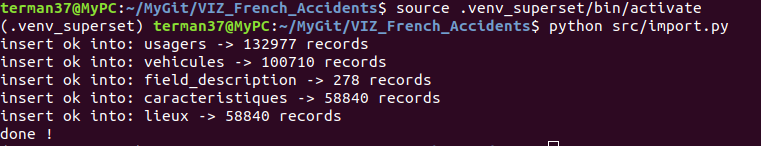
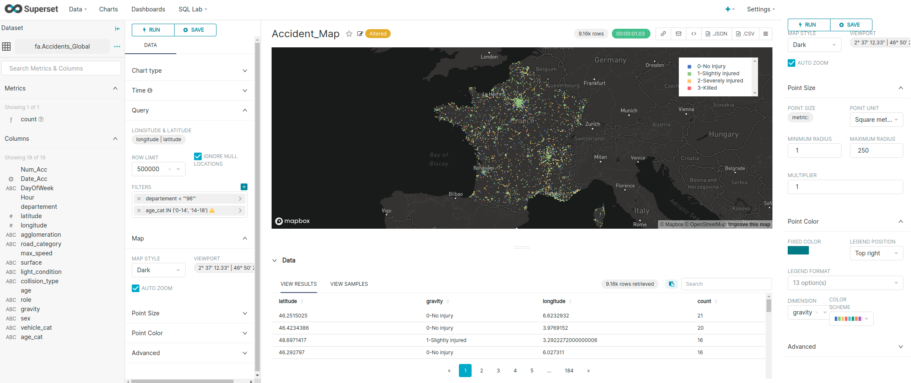
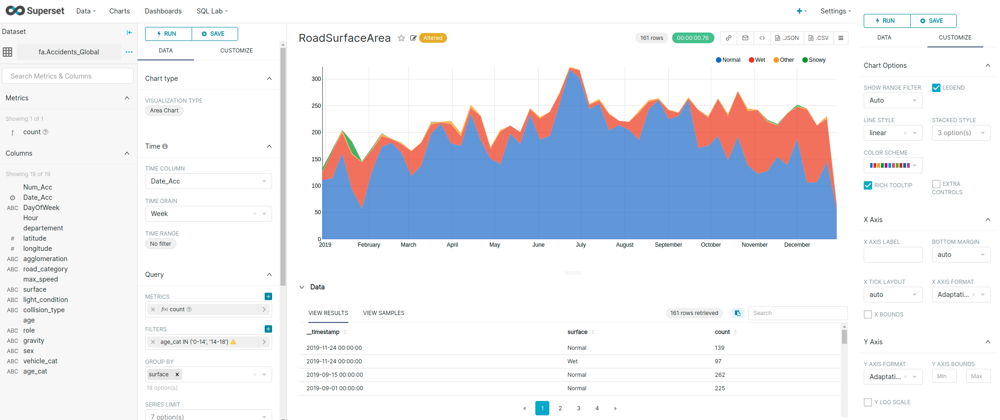
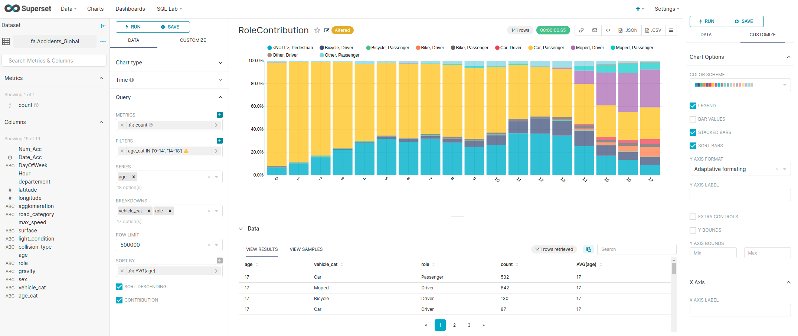

# Apache SuperSet analysing French kids accidents


Apache Superset is a modern data exploration and visualization platform allowing to create nice and interactive dashboard for data visualization.

I wanted to test its capabilities through analysis of open dataset regarding road accidents in France (especially involving kids)


## Installation

- Version: 0.999.0dev

### Run with docker compose

[Clone Superset's repo](https://github.com/apache/superset) in your terminal with the following command:

```bash
git clone https://github.com/apache/superset.git
```

Once that command completes successfully, you should see a new `superset` folder in your current directory.

```bash
cd superset
docker-compose up
```

### Connect and create user

navigate to:`127.0.0.1:8088` and login as `admin` / `admin`

Pretty straight forward: in the top right corner: settings / users


## Used Dataset

### Description

Dataset found [here](https://www.data.gouv.fr/fr/datasets/bases-de-donnees-annuelles-des-accidents-corporels-de-la-circulation-routiere-annees-de-2005-a-2019/) on data.gouv.fr

Complete field description [here](docs/description-des-bases-de-donnees-onisr-annees-2005-a-2019.pdf) in french only, sorry :-(

### Database

#### Launch

from docker-compose in my repo

```bash
docker-compose up
```

#### Create MySQL user

connect to container

```bash
docker ps
docker exec -it <CONTAINER ID> /bin/bash
mysql -u root -p
```

from mysql shell:

```mysql
CREATE USER 'user'@'%' IDENTIFIED WITH mysql_native_password BY 'password';
GRANT ALL PRIVILEGES ON *.* TO 'user'@'%';
FLUSH PRIVILEGES;
```

#### Datas preprocessing

I made a script to import datas to mysql:

```bash
python src/import.py
```



## Give Superset access to datas

### Connection driver

You might need to install connection driver if you want to access particular database. Follow superset [instructions](https://superset.apache.org/docs/databases/installing-database-drivers)

### Add Database connection

in menu: data/databases click on `+ DATABASE` and fill in necessary informations:


### Add Table as dataset

in menu: data/datasets click on `+ DATASET and fill in necessary informations:


### Add calculated field

In the datasets view click on edit button at the end of the dataset row


### Add Virtual Dataset

If you need to have more than one table, you manually create a SQL query (using SQL Lab Editor)

 

Then by clicking Explore, you will be able to save it as a virtual dataset and use it to create reports

## Dashboards & Charts

### Available Visualizations

A lot of nice visualizations are available, lets' checkout some of them


### FilterBox


### BigNumber


### Table


### Map ScatterPlot using MapBox

**Before using any visualization using MapBox you need to specify you token to access MapBox API**

Create an account on Mapbox.com and create a token.


Copy the token and add it in your superset `.env` file

```
cd superset
echo MAPBOX_API_KEY=<you token> > docker/.env
```





### Area Chart



### Bar Chart



### HeatMap


 


